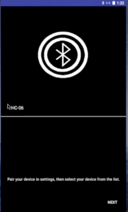

1) About
2) Application Organization
3) Overview of Features
4) Sources
5) Notes

### 1) About
This is an Android application. It connects via Bluetooth to the an Arduino
device that broadcasts pm2.5 concentration measurements.

The directory "EasyAir" is an Android Studio Project containing the Android
application. The directory "PM2.5_sensor_simple" contains the code for the
Arduino.

### 2) EasyAir Application Organization
jake.laney.easyair

    MainActivity.java - Top level activity
    
    -> adapters
    
        BluetoothDevicesAdapter.java - ListView needs to display available devices
        
        SwipePageAdapter.java - Helps manage swipe navigation between fragments
        
    -> fragments
    
        PMSensorFragment.java - Provides views for connecting/reading from the sensor
        
        PMHistoryFragment.java - Displays graphs of stored pm2.5 readings
        
        AboutFragment.java - displays an HTML page describing the app's features
        
    -> pmbt (PM Bluetooth)
    
        PMBTConnectThread.java - thread for connecting/reading from the sensor
        
        PMBTDataModel.java - model for local storage of pm2.5 data
        
        PMBTFileService.java - provides read/write for local storage
        
        PMBTHandler.java - Handler for communication between UI and Bluetooth threads
        
        PMBTService.java - Provides a bluetooth connection service to the UI
        
        -> interfaces
        
            IPMBTDeviceManager.java - interface handling bluetooth events
            
            EnumPMBTDates.java - Dates used by the file system
            
            IPMBTConstants.java - constants used for thread messages
            
    -> views
    
        CircleView.java - changes color with pm2.5 value
        
        LiveLineChart.java - updates as new data pm2.5 arrives
        
        HistoryLineChart.java - displays data from local storage
        
        StatusTextView.java - updates with pm2.5 to display quality of air

### 3) Overview of Features
Bluetooth

    * I added new features to the bluetooth functionality. The connection and
    listening actions have been moved to a separate thread. This prevents
    interruptions to the user. Once the user pairs a device, the device is
    automatically added to the list of options. Selecting a device opens a live
    data display. if connection is lost, the app returns to device selection.
    
Structural Features

    * I implemented swipe navigation for the app. Three pages exist:
    a pm2.5 sensor page, data history page, and an about page. I added buttons
    to the swipe navigation feature to allow easier control depending on the
    device that is used. The pm2.5 sensor page now has a moving graph that shows
    the data updating live. A circle around the pm2.5 value changes color as
    the value changes. A TextView provides a qualitative description of the value.
    The bluetooth animation at the bluetooth connection screen was also created by me.
    
Data Storage Features

    * I began implementing data storage, but this feature is only
    partially complete. The data history page shows some data on a graph.
    Although not complete, a lot of code now exists that allows read/write
    to local storage.

### 4) Sources

Charts/Graphing - https://github.com/PhilJay/MPAndroidChart

Bluetooth - https://developer.android.com/guide/topics/connectivity/bluetooth.html

Threading - https://developer.android.com/guide/components/processes-and-threads.html

Swipe Navigation - https://developer.android.com/training/implementing-navigation/lateral.html

PM2.5 Ranges - http://aqicn.org/faq/2013-09-09/revised-pm25-aqi-breakpoints/

### 5) Note

The file storage infrastructure is only partially complete. It can open and
read/write to the local data file. However, proper display with the PMHistoryFragment
is not yet complete.
